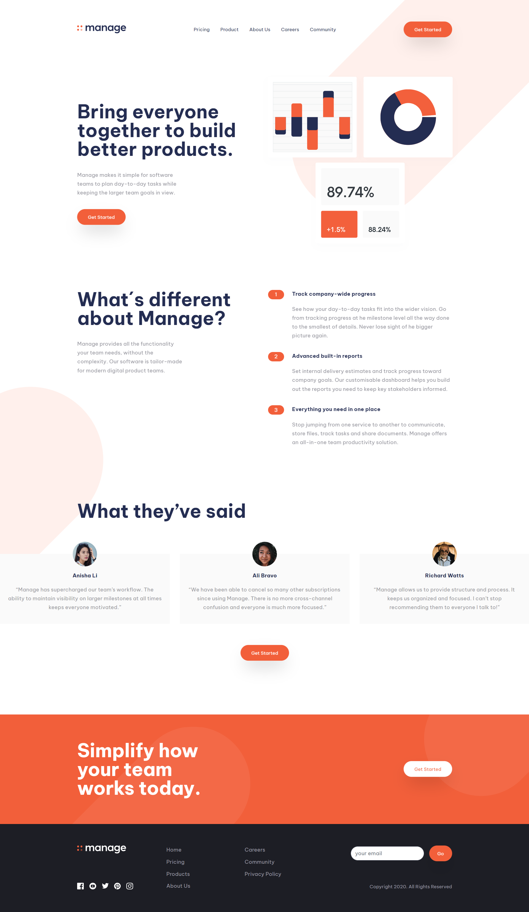

# Frontend Mentor - Manage landing page solution

This is a solution to the [Manage landing page challenge on Frontend Mentor](https://www.frontendmentor.io/challenges/manage-landing-page-SLXqC6P5). Frontend Mentor challenges help you improve your coding skills by building realistic projects.

## Table of contents

- [Frontend Mentor - Manage landing page solution](#frontend-mentor---manage-landing-page-solution)
  - [Table of contents](#table-of-contents)
  - [Overview](#overview)
    - [The challenge](#the-challenge)
    - [Screenshot](#screenshot)
    - [Links](#links)
    - [Built with](#built-with)
    - [Useful resources](#useful-resources)
  - [Author](#author)

## Overview

### The challenge

Users should be able to:

- View the optimal layout for the site depending on their device's screen size
- See hover states for all interactive elements on the page
- See all testimonials in a horizontal slider
- Receive an error message when the newsletter sign up `form` is submitted if:
  - The `input` field is empty
  - The email address is not formatted correctly

### Screenshot

### Links

- Solution URL: [[Add solution URL here](https://github.com/jswebschmiede/fem-manage-landing-page-react)](https://github.com/jswebschmiede/fem-manage-landing-page-react)
- Live Site URL: [[Add live site URL here](https://fem-manage-landing-page-react.vercel.app/)](https://fem-manage-landing-page-react.vercel.app/)

### Built with

- Semantic HTML5 markup
- Tailwind
- Mobile-first workflow
- [React](https://reactjs.org/) - JS library

### Useful resources

- [Swiper](https://swiperjs.com/) - Best Slider Script
- [Vite](https://vitejs.dev/) - Best Tool to start your React Apps

## Author

- Website - [Jörg Schöneburg](https://jswebschmiede.de)
- Frontend Mentor - [@jswebschmiede](https://www.frontendmentor.io/profile/jswebschmiede)
- Github - [jswebschmiede](https://github.com/jswebschmiede)
